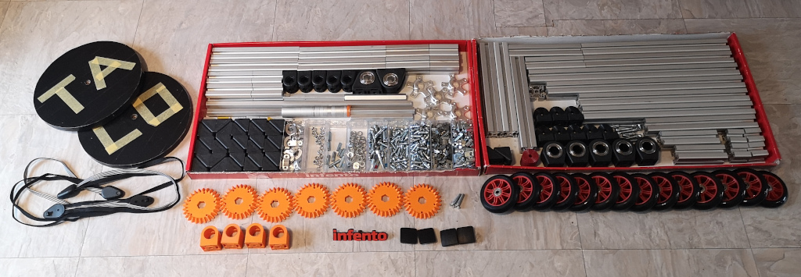
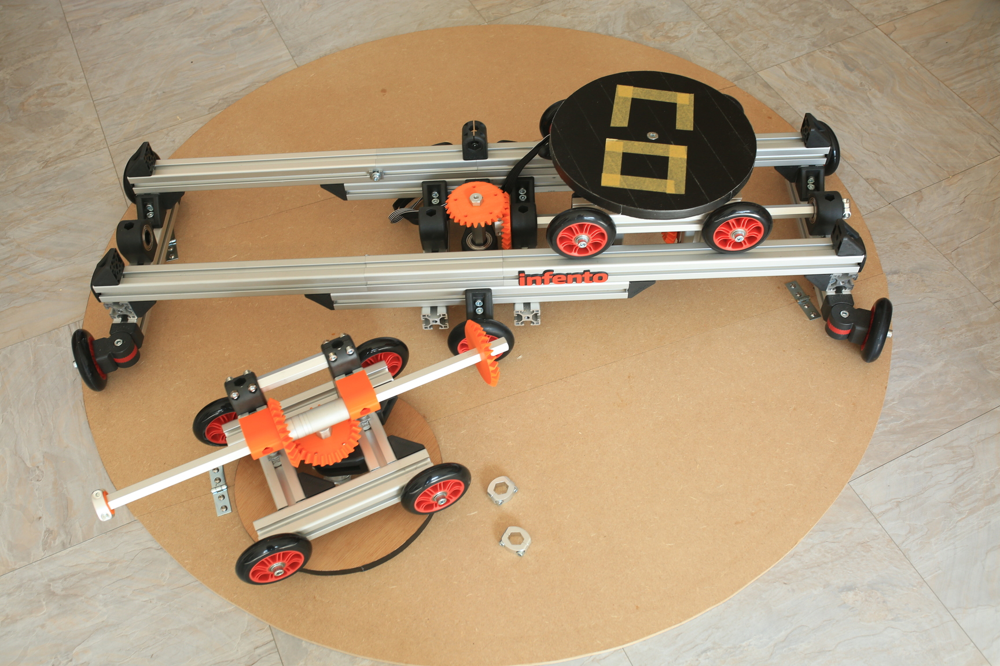
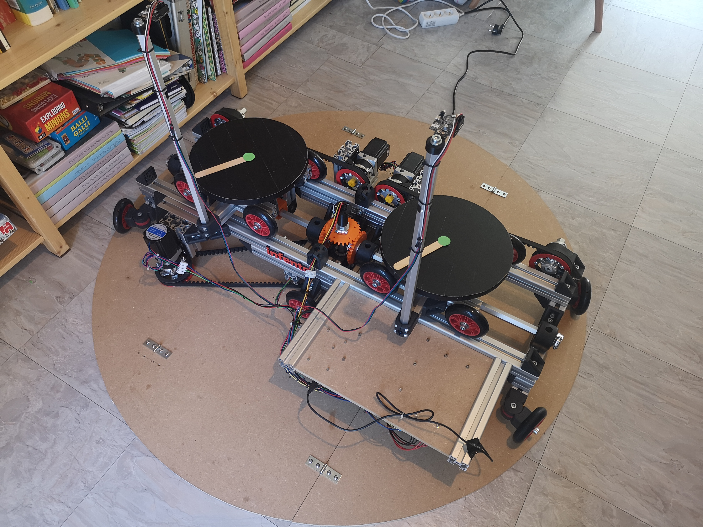

# TACO VR

An [Infento](https://www.infento.com/)-based omnidirectional VR treadmill (unfinished prototype!)

## Links

- [blog post announcement](http://blogfarts.blogspot.com/2022/03/taco-vr-infento-based-omnidirectional.html)
- [video showing movement mechanism](https://www.youtube.com/watch?v=YHPXaN3H2HI)
- [video showing automatic movement](https://www.youtube.com/watch?v=lmJdy6oKbso)
- [video showing feet tracking](https://www.youtube.com/watch?v=VliX2Mjm0tE)
- [appearance in thrillseeker tuesday newsday](https://www.youtube.com/watch?v=JtDdllBYgaA)

## Similar projects

- [RadixUniversal](https://www.youtube.com/watch?v=7YEqCsvkD60)
- [VR-crosswalk](https://www.youtube.com/watch?v=GcSgNpcmdVs)

## Infento parts list

order them at the [infento parts shop](https://www.infento.com/parts/)

- profile 560mm E12,71 (x4)
- profile 440mm E10,01 (x4)
- profile 280mm E6,41 (x2)
- profile 240mm E5,51 (x6)
- profile 160mm E3,71 (x3)
- profile 140mm E3,26 (x1)
- profile 130mm E3,04 (x2)
- profile 120mm E2,81 (x5)
- profile 100mm E2,36 (x2)
- profile 80mm  E1,91 (x4)
- profile 60mm  E1,46 (x2)
- profile 40mm  E1,01 (x2)
- profile spacer 5mm E0,11 (x6)
- axle 550mm E6,53 (x4)
- axle 166mm E2,01 (x3)
- axle 122mm E1,49 (x2)
- axle 101mm E1,24 (x2)
- axle flange E8,60 (x10) (ugh!)
- spacer 50mm E1,62 (x2)
- spacer 10mm E0,59 (x4)
- spacer 5mm E0,50 (x5)
- spacer 2mm E0,48 (x3)
- spacer 1mm E0,46 (x8)
- L-joint E1,35 (x42)
- bearing block 40x80 hexa E9,52 (x2)
- bearing block 40x40 hexa E9,17 (x6)
- 4 inch wheel E4,58 (x14)
- knurled disc 2 stripes E0,60 (x4)
- multi angle joint E1,43 (x8)
- axle clamp E1,93 (x8)
- clamping part with M6 thread E1,66 (x20)
- clamping part without thread E1,66 (x11)
- adjusting bolt M8x35 E0,24 (x11)
- M8-16 washer E0,01 (x58)
- T-positioning block E0,17 (x250) (may not be enough)
- profile nut short E0,30 (x120) (may not be enough)
- M6x12 bolt E0,04 (x50)
- M6x20 bolt E0,04 (x30)
- M6x25 bolt E0,07 (x14)
- M6 nut E0,02 (x8)
- M8x25 bolt E0,09 (x3)
- M8x40 bolt E0,12 (x14)
- M8x45 bolt E0,16 (x4)
- M8x20 bolt flat head E0,16 (x120) (may not be enough)
- M8 nut E0,02 (x4)
- M8 locknut E0,03 (x4)
- toothed belt pulley 26T + protection ring E2,16 (x5)
- toothed belt pulley 46T + protection ring E4,34
- toothed belt 100T E8,79 (probably 118T works better)
- toothed belt 118T E10,28 (x2)
- profile connector B E1,46 (x2)
- parallel clamp joint E0,92 (x4)

## Electronics components

- [arduino mega 2560](https://store.arduino.cc/products/arduino-mega-2560-rev3), E40,30
- [NEMA23 10:1 geared stepper motor](https://www.omc-stepperonline.com/nema-23-stepper-motor-l-76mm-gear-ratio-10-1-plm-series-planetary-gearbox-23hs30-2904s-plm23-g10-d8), E55,65 (x3)
- [stepper motor brackets](https://www.omc-stepperonline.com/nema-23-bracket-for-high-precision-planetary-geared-motor-alloy-steel-bracket-st-m9)
  - (the planetary gearbox does not fit in a standard NEMA23 bracket..) E2,51 (x3)
- [stepper driver](https://www.omc-stepperonline.com/digital-stepper-driver-2-4-7-2a-20-80vdc-for-nema-34-stepper-motor-cnc-drive-dm860i) E35,15 (x3)
- [power supply](https://www.conrad.com/p/mean-well-rsp-320-24-acdc-psu-module-enclosure-134-a-3216-w-24-v-dc-1293056) E70,99
- [slip ring](https://botland.store/slip-connectors/7144-slip-ring-3-wire-10a-22mm-5904422360009.html) E21,48
- [pixy2 camera](https://pixycam.com/pixy2/) E66,31 (x2)

## 3D-printed parts

- [bevel gear](https://www.thingiverse.com/thing:5179582) (x7)
- ["slider"](https://www.thingiverse.com/thing:5254832) (x4)

## Other parts/tools

- M6 thread reamer
- M6 drill bit
- M8x35 sunken head screws (x3), for center hole in platform/base
- round base plate, diameter ~130 cm
- small round platform ~18mm thick, diameter ~29 cm (x2)
- tape to go between axles and gears, to avoid any movement (depending on 3d printer precision)

## Cost estimation

- electronics: E545,32 (excluding shipping)
- infento parts: E760,83 (excluding shipping)
- total: E1306,15, more realistically around E1500 including shipping, wiring, wooden parts..

## Background information/calculations

### TODO what is the acceleration of a typical foot while walking?
### TODO torque/acceleration/sound level of hydraulics?

## Current status

## TODO
- detect step-down (speed approaching 0?)
- investigate jitter at high platform speed
- intestigate slack in rotation (need 48v/nema34?)
- make video showing walking/turning in several directions :-)
