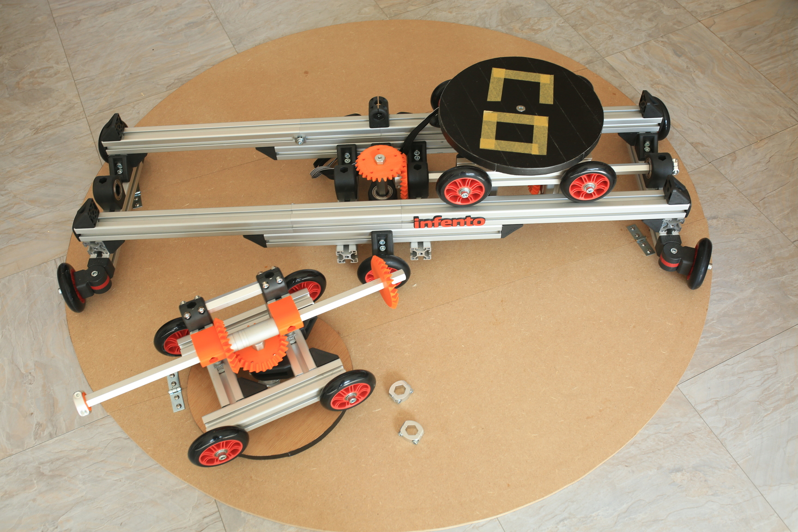

# TACO VR
An infento-based omnidirectional VR treadmill (unfinished prototype!)

# Links

[blog post announcement](http://blogfarts.blogspot.com/2022/03/taco-vr-infento-based-omnidirectional.html)

[video showing mechanical movement](https://www.youtube.com/watch?v=YHPXaN3H2HI)

[appearance in thrillseeker tuesday newsday](https://www.youtube.com/watch?v=JtDdllBYgaA)

# Similar projects

[RadixUniversal](https://www.youtube.com/watch?v=7YEqCsvkD60)

[VR-crosswalk](https://www.youtube.com/watch?v=GcSgNpcmdVs)

# Infento parts list

profile 560mm (x4)

profile 440mm (x2)

profile 280mm (x4)

profile 240mm (x4)

profile 140mm (x1)

profile 120mm (x5)

profile 80mm  (x4)

profile 40mm  (x4)

profile spacer 5mm (x4)

axle 550mm (x2)

axle 166mm (x3)

axle 122mm (x2)

axle flang (x5)

spacer 50mm (x2)

spacer 10mm (x4)

spacer 5mm  (x5)

spacer 2mm  (x3)

spacer 1mm  (x8)

L-joint (x32)

bearing block 40x80 hexa (x2)

bearing block 40x40 hexa (x5)

4 inch wheel (x14)

knurled disc 2 stripes (x4)

multi angle joint (x8)

axle clamp (x5)

clamping part with M6 thread (x12)

clamping part without thread (x7)

adjusting bolt M8x35 (x11)

M8-16 washer (x58)

T-positioning block (x200)

profile nut short (x90)

M6x12 bolt (x25)

M6x20 bolt (x24)

M6x25 bolt (x8)

M6 nut (x8)

M8x25 bolt (x3)

M8x40 bolt (x14)

M8x45 bolt (x4)

M8x20 bolt flat head (x90)

M8 nut (x4)

M8 locknut (x4)

optional:

infento name emblem (x1)

protect cap (x4, or more)

# 3D-printed parts

[bevel gear](https://www.thingiverse.com/thing:5179582) (x7)

["slider"](https://www.thingiverse.com/thing:5254832) (x4)

# Other parts/tools

M6 thread reamer

M6 drill bit

M8x35 sunken head screws (x3), for center hole in platform/base

bicycle bungee cord (x2)

round base plate, diameter ~130 cm

small round platform ~18mm thick, diameter ~29 cm (x2)

tape to go between axles and gears, to avoid any movement (depending on 3d printer precision)

# Potential electronics components (ordered by srepmub)

(as seen in a [dronebot workshop](https://www.youtube.com/watch?v=iY_4YOlpqyI))

[NEMA23 stepper motor](https://www.robotshop.com/en/nema-23-bipolar-425ozin-42a-57x57x114mm-4-wires-stepper-motor.html)

[stepper driver](https://www.robotshop.com/en/20-80v-24-72a-digital-stepper-motor-driver-nema-34.html)

[power supply](https://www.conrad.com/p/mean-well-rsp-320-24-acdc-psu-module-enclosure-134-a-3216-w-24-v-dc-1293056)

[slip ring](https://www.amazon.nl/dp/B08NVK6C85/ref=pe_28126711_487102941_TE_SCE_3p_dp_1)

Current status (rotation probably won't work like this):

![Screenshot][elec.png]

Next step is to add wiring, and start programming some basic moves.
