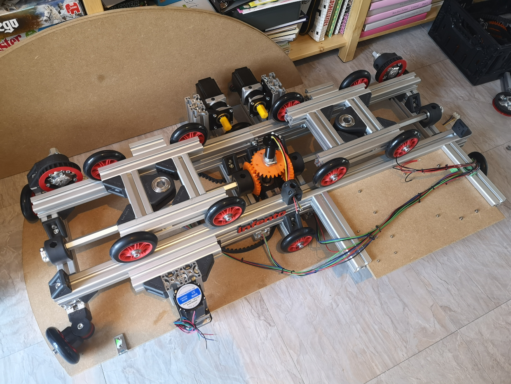

# TACO VR

An [Infento](https://www.infento.com/)-based omnidirectional VR treadmill (unfinished prototype!)

## Links

- [blog post announcement](http://blogfarts.blogspot.com/2022/03/taco-vr-infento-based-omnidirectional.html)
- [video showing movement mechanism](https://www.youtube.com/watch?v=YHPXaN3H2HI)
- [video showing automatic movement](https://www.youtube.com/watch?v=lmJdy6oKbso)
- [video showing feet tracking](https://www.youtube.com/watch?v=dd_dxFAD24o)
- [appearance in thrillseeker tuesday newsday](https://www.youtube.com/watch?v=JtDdllBYgaA)

## Similar projects

- [RadixUniversal](https://www.youtube.com/watch?v=7YEqCsvkD60)
- [VR-crosswalk](https://www.youtube.com/watch?v=GcSgNpcmdVs)

## Infento parts list

order them at the [infento parts shop](https://www.infento.com/parts/)

- profile 560mm (x4)
- profile 440mm (x4)
- profile 280mm (x2)
- profile 240mm (x6)
- profile 160mm (x1)
- profile 140mm (x1)
- profile 120mm (x5)
- profile 100mm (x2)
- profile 80mm  (x4)
- profile 60mm  (x2)
- profile 40mm  (x4)
- profile spacer 5mm (x6)
- axle 550mm (x4)
- axle 166mm (x3)
- axle 122mm (x2)
- axle 101mm (x2)
- axle flange (x7)
- spacer 50mm (x2)
- spacer 10mm (x4)
- spacer 5mm  (x5)
- spacer 2mm  (x3)
- spacer 1mm  (x8)
- L-joint (x42)
- bearing block 40x80 hexa (x2)
- bearing block 40x40 hexa (x7)
- 4 inch wheel (x14)
- knurled disc 2 stripes (x4)
- multi angle joint (x8)
- axle clamp (x8)
- clamping part with M6 thread (x24)
- clamping part without thread (x15)
- adjusting bolt M8x35 (x11)
- M8-16 washer (x58)
- T-positioning block (x200)
- profile nut short (x90)
- M6x12 bolt (x25)
- M6x20 bolt (x24)
- M6x25 bolt (x8)
- M6 nut (x8)
- M8x25 bolt (x3)
- M8x40 bolt (x14)
- M8x45 bolt (x4)
- M8x20 bolt flat head (x90)
- M8 nut (x4)
- M8 locknut (x4)
- toothed belt pulley 26T + protection ring (x5)
- toothed belt pulley 46T + protection ring
- toothed belt 100T

## Electronics components

- [arduino mega 2560](https://store.arduino.cc/products/arduino-mega-2560-rev3), E40,30
- [NEMA23 10:1 geared stepper motor](https://www.omc-stepperonline.com/nema-23-stepper-motor-l-76mm-gear-ratio-10-1-plm-series-planetary-gearbox-23hs30-2904s-plm23-g10-d8), E55,65 (x3)
- [stepper motor brackets](https://www.omc-stepperonline.com/nema-23-bracket-for-high-precision-planetary-geared-motor-alloy-steel-bracket-st-m9)
  - (the planetary gearbox does not fit in a standard NEMA23 bracket..) E2,51 (x3)
- [stepper driver](https://www.omc-stepperonline.com/digital-stepper-driver-2-4-7-2a-20-80vdc-for-nema-34-stepper-motor-cnc-drive-dm860i) E35,15 (x3)
- [power supply](https://www.conrad.com/p/mean-well-rsp-320-24-acdc-psu-module-enclosure-134-a-3216-w-24-v-dc-1293056) E70,99
- [slip ring](https://botland.store/slip-connectors/7144-slip-ring-3-wire-10a-22mm-5904422360009.html) E21,48
- [pixy2 camera](https://pixycam.com/pixy2/) E66,31 (x2)

## 3D-printed parts

- [bevel gear](https://www.thingiverse.com/thing:5179582) (x7)
- ["slider"](https://www.thingiverse.com/thing:5254832) (x4)

## Other parts/tools

- M6 thread reamer
- M6 drill bit
- M8x35 sunken head screws (x3), for center hole in platform/base
- bicycle bungee cord (x2)
- round base plate, diameter ~130 cm
- small round platform ~18mm thick, diameter ~29 cm (x2)
- tape to go between axles and gears, to avoid any movement (depending on 3d printer precision)

## Cost estimation

- electronics: E545.32 (excluding shipping)
- Infento: about 700 euros. 

Will add extra Infento parts for adding electronics, and calculate more precisely.

## Current status

## TODO
- test rotational movement
- calculate absolute feet positions to detect step down
- investigate jitter at high platform speed
- make stable foot mirror moving foot, so everything stays centered
- make video showing walking/turning in several directions :-)
